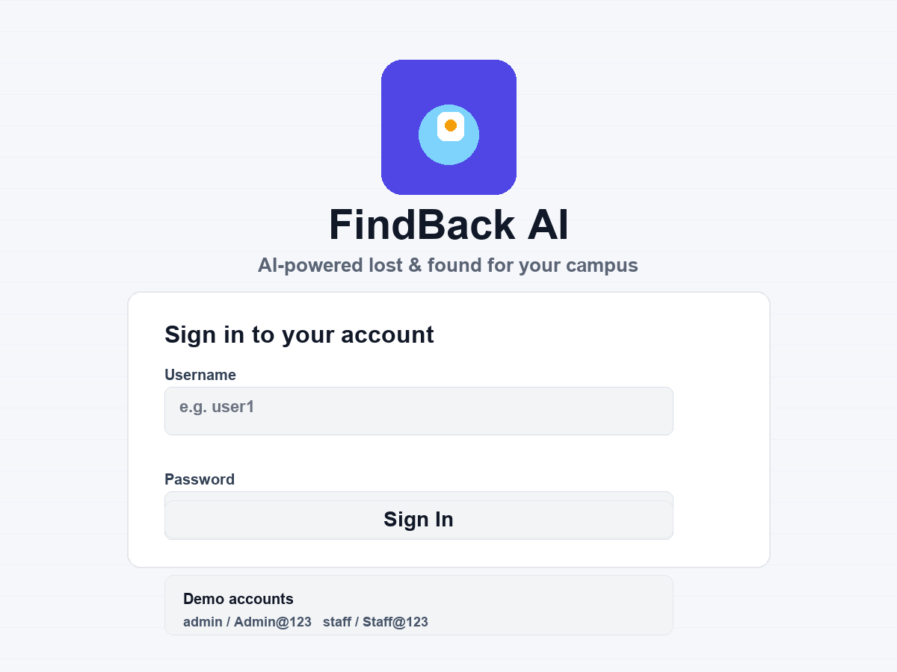
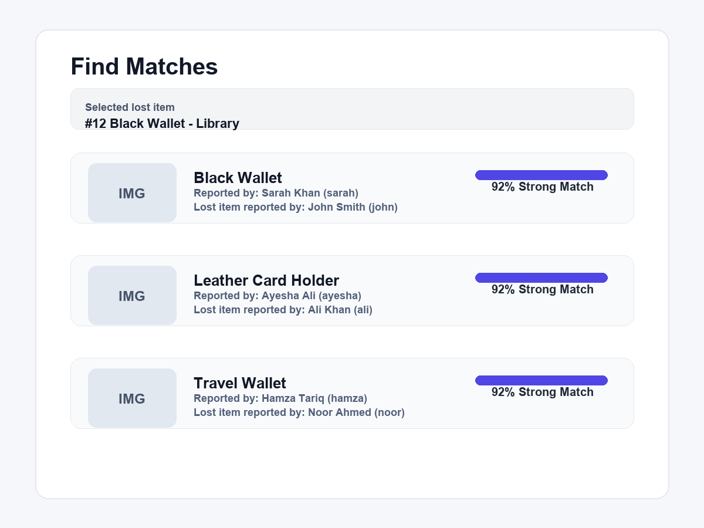
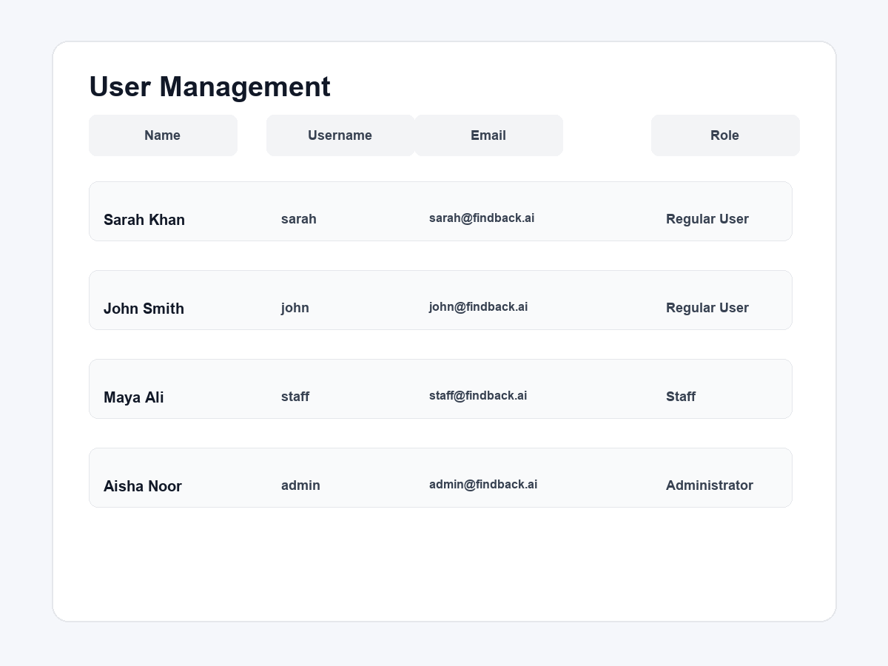

# FindBack AI

FindBack AI is a Streamlit-based lost and found platform for campuses and organizations. It lets users report lost or found items, compare possible matches with AI-powered similarity analysis, and lets staff/admin review claims and ownership records.

## Overview

This app helps users:

- report lost items
- report found items
- search for likely matches using semantic and rule-based scoring (available to all signed-in users)
- review claim history and resolve ownership disputes
- manage users with role-based access
- allow administrators to reset lost/found transaction data after completed handovers

It is designed for real-world campus operations where staff need to quickly identify who reported what and which item pair is most likely related.

## Features

- Lost and found item reporting
- AI-powered matching using similarity scoring
- Role-based access for admin, staff, and regular users
- Find Matches is available to all signed-in users
- Staff/admin visibility of user full names and contact details
- Claim lifecycle management for review and handover approval
- Administrator-only data reset after completed finding/handover
- Demo credentials for quick testing
- SQLite database that initializes automatically

## Screenshots

### Login screen



### Match results screen



### User management screen



## Tech Stack

- Python 3.10+
- Streamlit
- SQLite
- FAISS
- NumPy
- PyTorch
- Sentence transformers / embedding models
- Pillow

## Prerequisites

Before running the project, make sure you have:

- Python 3.10 or newer
- pip installed
- git installed (optional, if cloning from GitHub)
- a virtual environment tool

Optional:

- AI provider API key for Groq or Hugging Face if you want the app to use live AI extraction and explanation features

## Step-by-step setup for a new machine

### 1. Clone the project

```bash
git clone https://github.com/mdanyal-khan/findbackAI.git
cd findback-ai
```

### 2. Create a virtual environment

On Windows PowerShell:

```powershell
python -m venv .venv
.\.venv\Scripts\Activate.ps1
```

On Windows Command Prompt:

```bat
python -m venv .venv
.venv\Scripts\activate.bat
```

On macOS / Linux:

```bash
python3 -m venv .venv
source .venv/bin/activate
```

### 3. Install dependencies

```bash
pip install --upgrade pip
pip install -r requirements.txt
```

### 4. Verify installation

```bash
python --version
pip list
```

### 5. Start the application

From the project root:

```bash
streamlit run app.py
```

The app will start and show a localhost URL in the terminal, usually:

```text
http://localhost:8501
```

Open that URL in your browser.

## Optional: configure AI provider keys

If you want to use AI-powered item extraction or explanation features with a real provider, create a Streamlit secrets file in your project folder:

```toml
# .streamlit/secrets.toml
[GROQ]
API_KEY = "your_groq_api_key"
```

The provider configuration also supports the top-level Streamlit secret:

```toml
GROQ_API_KEY = "your_groq_api_key"
```

Or for Hugging Face:

```toml
# .streamlit/secrets.toml
[HUGGINGFACE]
API_KEY = "your_huggingface_api_key"
```

If you skip this step, the app can still run with demo/default behavior. The project will create its database automatically when launched.

## Demo accounts

The application seeds demo users automatically on first launch:

| Username | Password | Role |
| --- | --- | --- |
| admin | Admin@123 | Administrator |
| staff | Staff@123 | Staff |
| user1 | User@123 | Regular User |
| user2 | User@123 | Regular User |
| user3 | User@123 | Regular User |

## How to use the app

1. Sign in using one of the demo accounts.
2. Choose Report Lost or Report Found.
3. Add item details, optional photo, and location.
4. Go to Find Matches to compare a lost item with possible found items. This function is available to all signed-in users.
5. Staff/admin can review the item reporter names and contact information.
6. Approve or resolve matching claims from the claim review section.

## Role-based access and administrator controls

The application uses three roles:

| Role | Main access |
| --- | --- |
| Administrator | Full administrative access, including User Management and the data reset function |
| Staff | Staff claim review and handover functions |
| Regular User | Report lost/found items and use Find Matches |

### Find Matches access

**Find Matches is available to all signed-in users** (Administrator, Staff, and Regular User). Users can use AI/rule-based matching to compare lost and found items.

### Administrator-only reset

After an item has been successfully handed over and the claim is resolved, an **Administrator** can reset the application's transactional FindBack data from the **User Management** page.

The reset removes:

- lost/found item records
- item features
- matches
- claims
- notifications
- AI usage records

It **does not delete user accounts**.

For safety, the administrator must type `RESET` before the reset button becomes active. This is a permanent data-clearing operation and is intended to start a new operational cycle with empty dashboard counters.

## Project structure

```text
findback-ai/
├── app.py
├── auth.py
├── requirements.txt
├── README.md
├── .gitignore
├── ai/
│   ├── embeddings.py
│   ├── groq_provider.py
│   ├── huggingface_provider.py
│   ├── matcher.py
│   ├── prompts.py
│   ├── provider.py
│   └── schemas.py
├── components/
├── data/
├── database/
│   ├── database.py
│   └── queries.py
├── docs/
│   └── screenshots/
├── services/
│   ├── claim_service.py
│   ├── image_service.py
│   ├── item_service.py
│   ├── matching_service.py
│   └── provider_service.py
│   └── notification_service.py
├── tests/
├── utils/
├── vector_store/
├── findback.db
└── .streamlit/
```

## Running tests

To run the automated tests:

```bash
pytest
```

## Notes

- The app automatically creates its SQLite database on first run if one does not exist.
- Users and demo accounts are seeded automatically.
- Match scoring uses a combination of text, category, location, time, and image signals.
- If no AI provider is configured, the app can still run in a simplified mode.

## License

This project currently does not include a formal open-source license file. Please check with the project owner before commercial or public redistribution.
